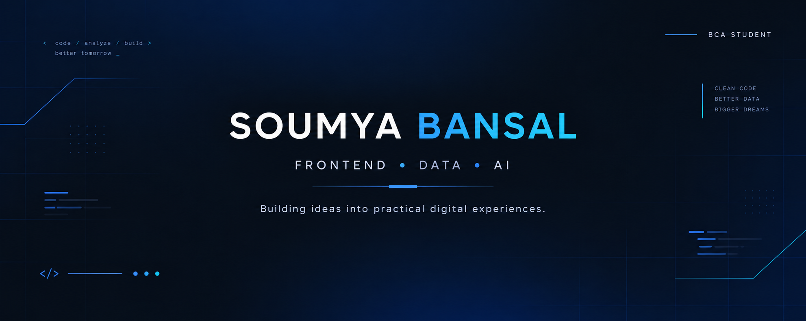

<p align="center">
  
</p>

<div align="center">

# Hi, I'm Soumya Bansal 👋

### BCA Student • Frontend Developer • Data Analytics Enthusiast

Building clean web experiences, exploring data, and learning how AI
can make development smarter.

</div>

---

## 👩‍💻 About Me

I'm a BCA student interested in building practical technology projects
that combine **frontend development, data and problem solving**.

I enjoy turning ideas into responsive websites and exploring datasets
to discover useful patterns and insights.

Currently working on strengthening my skills in:

- Frontend Development
- JavaScript & React
- Python & SQL
- Data Analytics
- AI-assisted development

---

## 🛠️ Tech Stack

### Frontend

<p>


</p>

### Programming & Data

<p>


</p>

### Tools

<p>


</p>

---

### 🏆 Athelio Sports Management

A frontend website created for a sports committee to showcase its
work, activities and information through a structured digital
experience.

**Focus:** Frontend Development • Responsive Design • UI/UX

[View Live Demo]([YOUR_ATHELIO_REPO_LINK](https://www.atheliosportsmanagement.com/))

---

### ☕ Brewtiful

A responsive coffee website created as a minor project, featuring
coffee categories, menu browsing and cart functionality.

**Focus:** HTML • CSS • JavaScript • Responsive Design

[View Project](YOUR_BREWTIFUL_REPO_LINK)

---

### 📊 Video Game Sales Analysis

A data analysis project exploring video game sales data using
Python and Jupyter Notebook.

**Focus:** Python • Data Analysis • Data Visualization

[View Project](YOUR_VG_REPO_LINK)

---

## 📈 Data & Machine Learning

### 🌲 Forest Cover Type ML

Machine learning exploration using the Forest Cover Type dataset.

**Focus:** Python • Machine Learning • Data Preprocessing

[View Project](YOUR_COVTYPE_REPO_LINK)

---

## 🌱 Currently Learning

```text
JavaScript       ███████░░░
React            █████░░░░░
Python           ██████░░░░
SQL              ██████░░░░
Data Analytics   █████░░░░░
AI Tools         ██████░░░░
